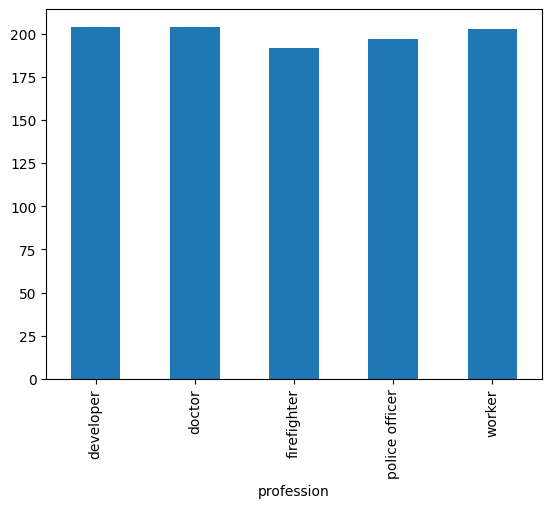

## Ejercicio UNIDAD 19 - PANDAS 1

 1.  Instalar Pandas en Jupyter Notebook.
 2.  Cargar un data frame desde un archivo csv.
 3. Cargar un data frame distinto desde un archivo Excel.
 4. Mostrar los datos de ambos dataframes.
 5. Instalar Pandas y Matplotlib.
 6. Realizar las siguientes acciones sobre el segundo dataframe:
 
	● Group By sobre un campo y utilizando sum()
	
	● ealizar un Melt
 7.  Realizar un gráfico de Barras con el primer dataframe.


---

 1.  Instalar Pandas en Jupyter Notebook.
 
          pip install pandas

----

 2.  Cargar un data frame desde un archivo csv.


```python
import pandas as pd


df_csv = pd.read_csv('file.csv')
```

---

 3. Cargar un data frame distinto desde un archivo Excel.


```python
df_excel = pd.read_excel('excel.xlsx')
```

---

4. Mostrar los datos de ambos dataframes.


```python
df_csv
```


<div>
<style scoped>
    .dataframe tbody tr th:only-of-type {
        vertical-align: middle;
    }

    .dataframe tbody tr th {
        vertical-align: top;
    }

    .dataframe thead th {
        text-align: right;
    }
</style>
<table border="1" class="dataframe">
  <thead>
    <tr style="text-align: right;">
      <th></th>
      <th>firstname</th>
      <th>lastname</th>
      <th>profession</th>
      <th>age</th>
    </tr>
  </thead>
  <tbody>
    <tr>
      <th>0</th>
      <td>Sam</td>
      <td>Wilkinson</td>
      <td>police officer</td>
      <td>26</td>
    </tr>
    <tr>
      <th>1</th>
      <td>Isa</td>
      <td>Annice</td>
      <td>police officer</td>
      <td>25</td>
    </tr>
    <tr>
      <th>2</th>
      <td>Gwenneth</td>
      <td>Beebe</td>
      <td>worker</td>
      <td>24</td>
    </tr>
    <tr>
      <th>3</th>
      <td>Ottilie</td>
      <td>Remmer</td>
      <td>police officer</td>
      <td>22</td>
    </tr>
    <tr>
      <th>4</th>
      <td>Rosene</td>
      <td>Zrike</td>
      <td>doctor</td>
      <td>22</td>
    </tr>
    <tr>
      <th>...</th>
      <td>...</td>
      <td>...</td>
      <td>...</td>
      <td>...</td>
    </tr>
    <tr>
      <th>995</th>
      <td>Sandie</td>
      <td>Heidt</td>
      <td>worker</td>
      <td>29</td>
    </tr>
    <tr>
      <th>996</th>
      <td>Trudie</td>
      <td>Gower</td>
      <td>developer</td>
      <td>22</td>
    </tr>
    <tr>
      <th>997</th>
      <td>Fidelia</td>
      <td>Abernon</td>
      <td>worker</td>
      <td>27</td>
    </tr>
    <tr>
      <th>998</th>
      <td>Brooks</td>
      <td>Phaidra</td>
      <td>firefighter</td>
      <td>28</td>
    </tr>
    <tr>
      <th>999</th>
      <td>Charissa</td>
      <td>Brunell</td>
      <td>doctor</td>
      <td>24</td>
    </tr>
  </tbody>
</table>
<p>1000 rows × 4 columns</p>
</div>


```python
df_excel
```


<div>
<style scoped>
    .dataframe tbody tr th:only-of-type {
        vertical-align: middle;
    }

    .dataframe tbody tr th {
        vertical-align: top;
    }

    .dataframe thead th {
        text-align: right;
    }
</style>
<table border="1" class="dataframe">
  <thead>
    <tr style="text-align: right;">
      <th></th>
      <th>Segment</th>
      <th>Country</th>
      <th>Product</th>
      <th>Discount Band</th>
      <th>Units Sold</th>
      <th>Manufacturing Price</th>
      <th>Sale Price</th>
      <th>Gross Sales</th>
      <th>Discounts</th>
      <th>Sales</th>
      <th>COGS</th>
      <th>Profit</th>
      <th>Date</th>
      <th>Month Number</th>
      <th>Month Name</th>
      <th>Year</th>
    </tr>
  </thead>
  <tbody>
    <tr>
      <th>0</th>
      <td>Government</td>
      <td>Canada</td>
      <td>Carretera</td>
      <td>None</td>
      <td>1618.5</td>
      <td>3</td>
      <td>20</td>
      <td>32370.0</td>
      <td>0.00</td>
      <td>32370.00</td>
      <td>16185.0</td>
      <td>16185.00</td>
      <td>2014-01-01</td>
      <td>1</td>
      <td>January</td>
      <td>2014</td>
    </tr>
    <tr>
      <th>1</th>
      <td>Government</td>
      <td>Germany</td>
      <td>Carretera</td>
      <td>None</td>
      <td>1321.0</td>
      <td>3</td>
      <td>20</td>
      <td>26420.0</td>
      <td>0.00</td>
      <td>26420.00</td>
      <td>13210.0</td>
      <td>13210.00</td>
      <td>2014-01-01</td>
      <td>1</td>
      <td>January</td>
      <td>2014</td>
    </tr>
    <tr>
      <th>2</th>
      <td>Midmarket</td>
      <td>France</td>
      <td>Carretera</td>
      <td>None</td>
      <td>2178.0</td>
      <td>3</td>
      <td>15</td>
      <td>32670.0</td>
      <td>0.00</td>
      <td>32670.00</td>
      <td>21780.0</td>
      <td>10890.00</td>
      <td>2014-06-01</td>
      <td>6</td>
      <td>June</td>
      <td>2014</td>
    </tr>
    <tr>
      <th>3</th>
      <td>Midmarket</td>
      <td>Germany</td>
      <td>Carretera</td>
      <td>None</td>
      <td>888.0</td>
      <td>3</td>
      <td>15</td>
      <td>13320.0</td>
      <td>0.00</td>
      <td>13320.00</td>
      <td>8880.0</td>
      <td>4440.00</td>
      <td>2014-06-01</td>
      <td>6</td>
      <td>June</td>
      <td>2014</td>
    </tr>
    <tr>
      <th>4</th>
      <td>Midmarket</td>
      <td>Mexico</td>
      <td>Carretera</td>
      <td>None</td>
      <td>2470.0</td>
      <td>3</td>
      <td>15</td>
      <td>37050.0</td>
      <td>0.00</td>
      <td>37050.00</td>
      <td>24700.0</td>
      <td>12350.00</td>
      <td>2014-06-01</td>
      <td>6</td>
      <td>June</td>
      <td>2014</td>
    </tr>
    <tr>
      <th>...</th>
      <td>...</td>
      <td>...</td>
      <td>...</td>
      <td>...</td>
      <td>...</td>
      <td>...</td>
      <td>...</td>
      <td>...</td>
      <td>...</td>
      <td>...</td>
      <td>...</td>
      <td>...</td>
      <td>...</td>
      <td>...</td>
      <td>...</td>
      <td>...</td>
    </tr>
    <tr>
      <th>695</th>
      <td>Small Business</td>
      <td>France</td>
      <td>Amarilla</td>
      <td>High</td>
      <td>2475.0</td>
      <td>260</td>
      <td>300</td>
      <td>742500.0</td>
      <td>111375.00</td>
      <td>631125.00</td>
      <td>618750.0</td>
      <td>12375.00</td>
      <td>2014-03-01</td>
      <td>3</td>
      <td>March</td>
      <td>2014</td>
    </tr>
    <tr>
      <th>696</th>
      <td>Small Business</td>
      <td>Mexico</td>
      <td>Amarilla</td>
      <td>High</td>
      <td>546.0</td>
      <td>260</td>
      <td>300</td>
      <td>163800.0</td>
      <td>24570.00</td>
      <td>139230.00</td>
      <td>136500.0</td>
      <td>2730.00</td>
      <td>2014-10-01</td>
      <td>10</td>
      <td>October</td>
      <td>2014</td>
    </tr>
    <tr>
      <th>697</th>
      <td>Government</td>
      <td>Mexico</td>
      <td>Montana</td>
      <td>High</td>
      <td>1368.0</td>
      <td>5</td>
      <td>7</td>
      <td>9576.0</td>
      <td>1436.40</td>
      <td>8139.60</td>
      <td>6840.0</td>
      <td>1299.60</td>
      <td>2014-02-01</td>
      <td>2</td>
      <td>February</td>
      <td>2014</td>
    </tr>
    <tr>
      <th>698</th>
      <td>Government</td>
      <td>Canada</td>
      <td>Paseo</td>
      <td>High</td>
      <td>723.0</td>
      <td>10</td>
      <td>7</td>
      <td>5061.0</td>
      <td>759.15</td>
      <td>4301.85</td>
      <td>3615.0</td>
      <td>686.85</td>
      <td>2014-04-01</td>
      <td>4</td>
      <td>April</td>
      <td>2014</td>
    </tr>
    <tr>
      <th>699</th>
      <td>Channel Partners</td>
      <td>United States of America</td>
      <td>VTT</td>
      <td>High</td>
      <td>1806.0</td>
      <td>250</td>
      <td>12</td>
      <td>21672.0</td>
      <td>3250.80</td>
      <td>18421.20</td>
      <td>5418.0</td>
      <td>13003.20</td>
      <td>2014-05-01</td>
      <td>5</td>
      <td>May</td>
      <td>2014</td>
    </tr>
  </tbody>
</table>
<p>700 rows × 16 columns</p>
</div>


---


 5. Instalar Pandas y Matplotlib.

           pip install matplotlib

---

 6. Realizar las siguientes acciones sobre el segundo dataframe:

	●  Group By sobre un campo y utilizando sum()
		
	●  Realizar un Melt


```python
df_csv_group = df_csv.groupby('profession').sum(numeric_only=True)
print(df_csv_group.head())
```

                     age
    profession          
    developer       5286
    doctor          5247
    firefighter     4956
    police officer  5116
    worker          5314


```python
df_excel_group = df_excel.groupby('Country',).sum(numeric_only=True)
print(df_excel_group.head())
```

                              Units Sold  Manufacturing Price  Sale Price  
    Country                                                                 
    Canada                      247428.5                13150       16580   
    France                      240931.0                13374       16580   
    Germany                     201494.0                13370       16580   
    Mexico                      203325.0                13394       16580   
    United States of America    232627.5                14246       16580   
    
                              Gross Sales    Discounts         Sales        COGS  
    Country                                                                        
    Canada                     26932163.5  2044508.615  2.488765e+07  21358426.0   
    France                     26081674.5  1727502.220  2.435417e+07  20573151.5   
    Germany                    24921467.5  1416126.680  2.350534e+07  19824952.0   
    Mexico                     22726935.0  1777582.890  2.094935e+07  18041829.0   
    United States of America   27269358.0  2239527.835  2.502983e+07  22034289.5   
    
                                   Profit  Month Number    Year  
    Country                                                      
    Canada                    3529228.885          1106  281925  
    France                    3781020.780          1106  281925  
    Germany                   3680388.820          1106  281925  
    Mexico                    2907523.110          1106  281925  
    United States of America  2995540.665          1106  281925  


- - - 


```python
df_csv.melt(id_vars=['firstname','lastname','age'])
```


<div>
<style scoped>
    .dataframe tbody tr th:only-of-type {
        vertical-align: middle;
    }

    .dataframe tbody tr th {
        vertical-align: top;
    }

    .dataframe thead th {
        text-align: right;
    }
</style>
<table border="1" class="dataframe">
  <thead>
    <tr style="text-align: right;">
      <th></th>
      <th>firstname</th>
      <th>lastname</th>
      <th>age</th>
      <th>variable</th>
      <th>value</th>
    </tr>
  </thead>
  <tbody>
    <tr>
      <th>0</th>
      <td>Sam</td>
      <td>Wilkinson</td>
      <td>26</td>
      <td>profession</td>
      <td>police officer</td>
    </tr>
    <tr>
      <th>1</th>
      <td>Isa</td>
      <td>Annice</td>
      <td>25</td>
      <td>profession</td>
      <td>police officer</td>
    </tr>
    <tr>
      <th>2</th>
      <td>Gwenneth</td>
      <td>Beebe</td>
      <td>24</td>
      <td>profession</td>
      <td>worker</td>
    </tr>
    <tr>
      <th>3</th>
      <td>Ottilie</td>
      <td>Remmer</td>
      <td>22</td>
      <td>profession</td>
      <td>police officer</td>
    </tr>
    <tr>
      <th>4</th>
      <td>Rosene</td>
      <td>Zrike</td>
      <td>22</td>
      <td>profession</td>
      <td>doctor</td>
    </tr>
    <tr>
      <th>...</th>
      <td>...</td>
      <td>...</td>
      <td>...</td>
      <td>...</td>
      <td>...</td>
    </tr>
    <tr>
      <th>995</th>
      <td>Sandie</td>
      <td>Heidt</td>
      <td>29</td>
      <td>profession</td>
      <td>worker</td>
    </tr>
    <tr>
      <th>996</th>
      <td>Trudie</td>
      <td>Gower</td>
      <td>22</td>
      <td>profession</td>
      <td>developer</td>
    </tr>
    <tr>
      <th>997</th>
      <td>Fidelia</td>
      <td>Abernon</td>
      <td>27</td>
      <td>profession</td>
      <td>worker</td>
    </tr>
    <tr>
      <th>998</th>
      <td>Brooks</td>
      <td>Phaidra</td>
      <td>28</td>
      <td>profession</td>
      <td>firefighter</td>
    </tr>
    <tr>
      <th>999</th>
      <td>Charissa</td>
      <td>Brunell</td>
      <td>24</td>
      <td>profession</td>
      <td>doctor</td>
    </tr>
  </tbody>
</table>
<p>1000 rows × 5 columns</p>
</div>


---

 7.  Realizar un gráfico de Barras con el primer dataframe.


```python
df_csv.groupby('profession')['profession'].count().plot(kind='bar')
```


    <AxesSubplot: xlabel='profession'>


    

    


---
